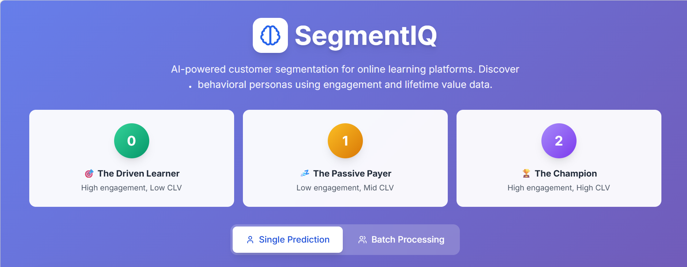
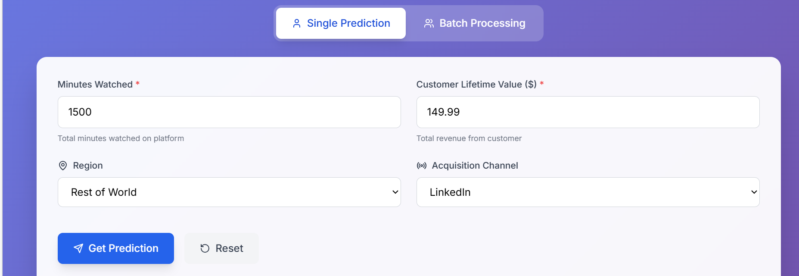
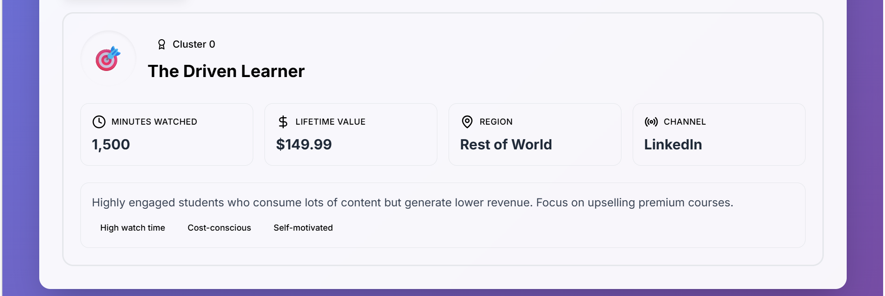

# 📊 Customer Segmentation & Persona Prediction System
## Overview
End-to-End Machine Learning Project (FastAPI + React + Model Pipeline)

This project implements a full **customer segmentation system** using clustering algorithms and persona assignment. It includes a trained ML pipeline, evaluation framework, persona mapping, FastAPI backend, and a production-ready React frontend for real-time predictions.

---

## Screenshots
### Web Application Interface





---

## Tech Stack
- Python
- Pandas
- NumPy
- Scikit-learn
- FastAPI
- Pydantic
- MySQL

---

# 🚀 Features

### **✅ Machine Learning Pipeline**
- Data ingestion, validation, preprocessing, and feature engineering  
- Standardization, log transforms, categorical encoding  
- Modular model trainer that trains multiple clustering algorithms  
- Evaluation and composite scoring  
- Persona assignment engine  
- Artifact persistence (preprocessor, model, personas)

### **✅ Backend API (FastAPI)**
- REST endpoint `/predict` for real-time inference  
- Input validation with Pydantic  
- Modular services for prediction and persona mapping  
- Response formatting for frontend consumption  
- Config-driven architecture

### **✅ Backend API (FastAPI)**
- REST endpoint `/predict` for real-time inference  
- Input validation with Pydantic  
- Modular services for prediction and persona mapping  
- Response formatting for frontend consumption  
- Config-driven architecture

### **✅ Production-Ready Architecture**
- Separation of concerns  
- Model artifacts stored in `/artifacts`  
- Reusable service modules  
- Logging, error-handling, versioned APIs  
- Extendable for A/B models, retraining, monitoring

---

# 📁 Project Structure
```
Customer_Segmetation_Marketing/
├── api/
│ ├── main.py
│ └── schemas.py
├── artifacts/
│ ├── models/
│ │ └── model.pkl
│ └── preprocessor.pkl
├── config/
│ └── config.yaml
├── data/
├── frontend/
│ └── src/
├── notebooks/
├── src/
│ ├── components/
│ ├── config/
│ ├── constants/
│ ├── entity/
│ ├── pipeline/
│ └── utils/
├── README.md
└── requirements.txt
```
---

# 🧠 Data Schema

### **Inputs**
| Variable          | Type       | Description |
|------------------|------------|-------------|
| minutes_watched  | Integer    | Total minutes content consumed |
| clv              | Integer    | Customer Lifetime Value |
| region           | Categorical {0,1,2} | Region grouping |
| channel          | Categorical {1–8} | Marketing acquisition channel |

### **Outputs**
```json
{
  "cluster": 0,
  "persona": "The Driven Learner",
  "description": "Students who watch high volumes but generate low CLV."
}
```

---

# ⚙️ Installation & Setup
### 1️⃣ Backend Setup
Create and activate virtual env

```Bash
python -m venv venv
source venv/bin/activate  # Win: venv\Scripts\activate
```

Install dependencies
`pip install -r requirements.txt`

Run FastAPI server
`uvicorn api.main:app --reload`

API Docs available at:
http://127.0.0.1:8000/docs

### 2️⃣ Frontend Setup
```Bash
cd frontend
npm install
npm run dev
```
UI runs at:
http://localhost:3000

---

# 📌 How Prediction Works
- User enters data in React form.
- UI sends a POST request to FastAPI backend.
- FastAPI:
  - Validates the input
  - Loads the preprocessor + model
  - Performs transformation
  - Predicts cluster
  - Maps cluster → persona
- Response returned to frontend.

---

# 🗺 Future Enhancements
- Add model monitoring (EvidentlyAI)
- Periodic retraining pipeline (Airflow / Prefect)
- Deploy on AWS / GCP / Render
- A/B testing between clustering algorithms
- Persona explanation with SHAP

---

# 🏆 Summary

This project delivers a complete, production-ready ML-powered Customer Segmentation System featuring:

- ✔ Full clustering pipeline
- ✔ Persona assignment
- ✔ FastAPI inference service
- ✔ React prediction UI
- ✔ Maintainable project structure

You now have a fully operational end-to-end ML system.

---

## Author
**Muhammad Basharat Asghar** \
Entry-Level Data Scientist \
[LinkedIn](https://www.linkedin.com/in/basharat-asghar/)
[Portfolio](https://basharat-asghar.github.io/BasharatPortfolio/)
